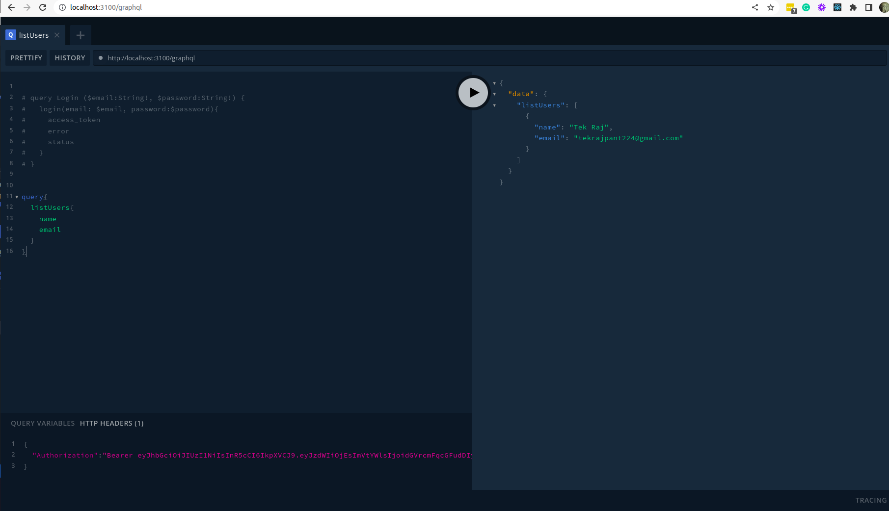

# This is a Ready to Go project for developing GraphQL API using NestJS
## Technology Used
 - NestJS
 - NestJS GraphQL
 - Prisma
 - PostgreSQL as database

 ## Database Setup
 - Create new Database in your PostgreSQL 
 - Create .env file and add the database Connection string for your database (for postgresql)
 - Inside prisma folder create your own schema  (you can reuse user table at least)
 - After creating schema run ` npx prisma migrate dev --name init`
 - Run ` npx prisma generate` to generate ObjectTypes, Args etc
 - Then Run the service-resolver-generator.js with `node service-resolver-generator.js` this will automatically generate the services and resolvers for all tables and these services and resolvers have basic CRUD operation
 - Run ` npx prisma db seed` to seed the Roles and Permissions
 - After this Run the project `nest start --watch`
 - Open http://localhost:3100/graphql 
 - Register new User
 - Then Login and get the access_token so that we can do the query
 - Now Run your mutations, queries  from GraphQL Play Ground play ground

 ## GraphQL Query With Access Token
 - Now go to HTTP Headers Section and add the access token
 